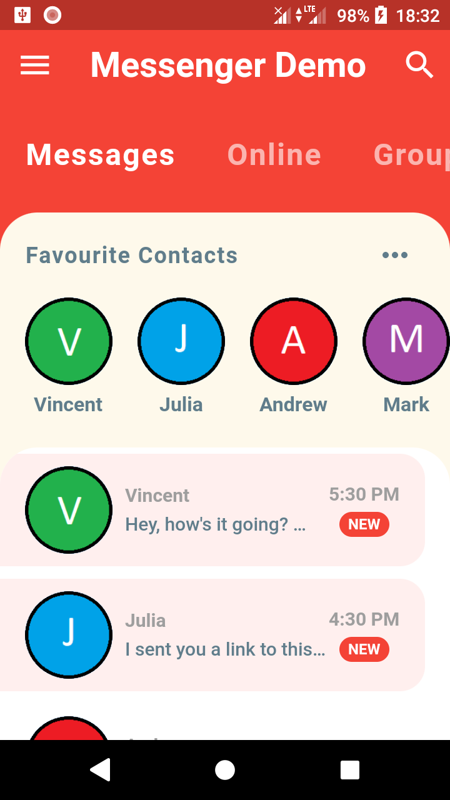
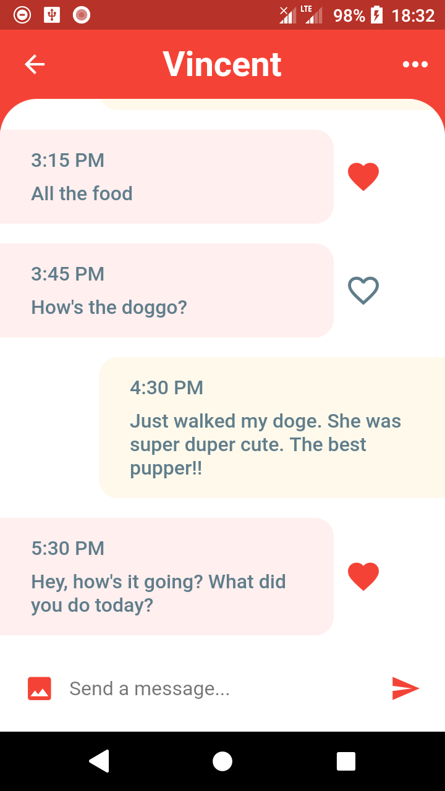

# Messenger Concept App

## What's new?

There is no new features.

## About project

A Messenger-like concept application made with Flutter framework. App made with tutorial on YouTube: https://www.youtube.com/watch?v=h-igXZCCrrc&list=LL&index=4&t=0s

Examples of working app below:

## Technologies used in the project

* Dart/Flutter

## Goals

Try Flutter framewrok and just learn.

## License

My project is under BSD-2-Clause license. You can use some parts from my code but remember to credit me as an appreciation to my work! Thanks! Awoo!

© 2022 Paweł "Wilczeq/Vlk" Turoń
